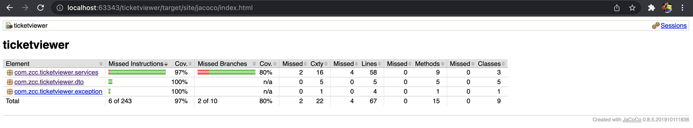

## Welcome to the ticketviewer

This is a part of Zendesk Coding Challenge. Here we are integrating with the Zendesk APIs to get the tickets for an user (not the customer).
Functionality:
* Retrieve all the tickets for the logged-in user.
* Retrieve the ticket based on the ticket number provided

## Installation Steps
This project is in java. To setup the environment for the project, please follow the following steps:

The installation steps on macOS are as follows:

To install java:
```sh
brew install openjdk@8
```

This project can be built and run using apache maven. To set up apache maven: 

```shell
1. Download Apache maven 3.8.4 zip from https://maven.apache.org/download.cgi and unzip 

2. Type the following command change the owner of the folder:
chown -R root:wheel apache-maven*

3. To make mvn command globally accessible, please add it to the environment path variable by adding the following command to the environment file:
export PATH=$PATH:/opt/apache-maven-3.8.4/bin
```


##Run the Application

To install the dependencies:
```shell
mvn clean install
```

To run the application:
```shell
mvn spring-boot:run 
```

The application is an interactive command line session. Please read the instructions in the terminal carefully and choose accordingly

As mentioned above, Zendesk API is used to retrieve the tickets which follows and username and password based authentication.
Hence, we need account ID and password of the user whose tickets are to be retrieved.
Please enter valid account ID and password when prompted. You can update them anytime throughout the session.

## Running test cases

Please use the following command to run the testcases:

```shell
mvn verify
```

To view the test coverage of the application, open the following file in the browser:
```shell
target/site/jacoco/index.html
```


## Notes
1. The application is using pagination and at a time 25 pages will be returned with an option to move forward and backward in the pages.
2. The tickets of the user whose account ID and password are retrieved.
3. The subdomain used is : https://zccphoenix.zendesk.com. If you want to change the subdomain, please update **zcc.url** in application.properties file.

## Possible Errors and Messages
1. If the credentials are not correct: **Invalid credentials(account id and password), please verify and try again**
2. If the API is not available: **Zendesk API not available**
3. If the API threw an unrecognized interna error : **Internal Server Error**
4. Bad Gateway : **Bad Gateway**
5. Time out: **Time out while connecting to Zendesk API**
6. No tickets found for the user : **No Tickets found!**